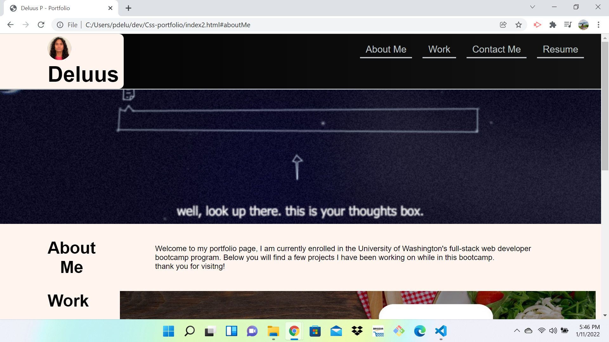

home work 2 making a portfolio 

created html
 - created parent and childern containers
 - defined the headers, elements, values, classes.
 - created div to put all the content within
 - linked to CSS and Reset.
 - created nav links for personal content
 -

created CSS style sheet
 - targeted all applicatble headers, classes, and atributes.
 - set all formatting styles with flex box, padding, margins,
 - inserted background pictures
 - created footer for contact info

<!-- updates made -->

- cleaned up code and formatted file structure on HTML and CSS pages.
- corrected and added projects with links to working websites
- created img file and moved all images to file
- Linked resume 
- added screenshot of page

 

GitHub link :

Deployed Repo :
